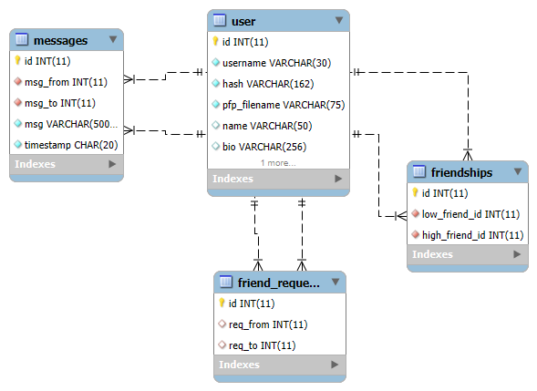

# Chatify
Chatify is an online messaging web app made using Flask and Socket.IO wherein you can create friends and chat with them live!

Short Video Demo: https://youtu.be/2klEwbfnoTY

## Features
### Some of the main features that are currently available :

- Customizing Profile
    - Profile Photo
    - Name
    - About Me

- Friend Requests
    - Send Requests
    - Accept / Reject Requests

- Messaging
    - Chat with friends in real-time
    - Optional profanity filter for incoming messages

## Frameworks / Technologies Used
1. Flask
2. SQLAlchemy + PyMySQL
3. AWS-S3
4. Flask-SocketIO

## Database Schema (refer `./database_ref/schemas.sql` for scripts)


## How to Contribute

### 1. Clone the Repository:
    
```bash
git clone https://github.com/ppl-call-me-tima/chatify.git
cd chatify
```

### 2. Create a Virtual Environment and Install the Requirements
```bash
py -3 -m venv .venv
.venv/Scripts/activate
pip install -r requirements.txt
```

### 3. Setting Up the Database Connection
The default method used for connection is using a cloud MySQL connection provider - TiDB. But to configure for a local MySQL connection, one must alter the connection string required for an SQLAlchemy + PyMySQL connection. The connection string is of the form:

```py
connection_string = f"mysql+pymysql://{username}:{password}@{host}/{dbname}?{option}"
```

<ol type="i">
<li>
Using Local MySQL Connection:

A suitable version of the connection string variables are already initialized in the commented form inside `database.py`.
</li>
<li>
Using TiDB Cloud MySQL Connection:

Visit the TiDB dashboard. Inside the configure options for the `Connecting to Cluster` menu, select the following:
- Connect With: SQLAlchemy
- Instead of `mysqlclient` select `PyMySQL`

You can now obtain the Connection String provided which requires the user to replace two parameters:
- PASSWORD - Which can be obtained by clicking on the Generate Password button in the same page (one-time view only).
- CA_PATH - The path of the CA Certificate which can be downloaded using the link visible in the same page.

Please re-configure the CA_PATH variable inside `database.py` correctly as it may be different for you.
</li>
</ol>


### 4. Setting Up Environment Variables (refer `.env.example`)

1. <strong>App Key:</strong> Generate a random secret app key that is required for Flask Sessions.

    ```bash
    python -c 'import secrets; print(secrets.token_hex())'
    ```

2. <strong>AWS Variables</strong>:
    <ol type="i">
        <li>
            AWS Bucket Name: The AWS-S3 Bucket used for storing profile photos has been named here and accessed universally throughout the code.
        </li>
        <li>
            AWS Access Key ID: (Standard S3 Credential)
        </li>
        <li>
            AWS Secret Access Key: (Standard S3 Credential)
        </li>
    </ol>

3. <strong>Database Connection Password:</strong> Database connection password can be:
    - set by the user in case of using a local MySQL connection
    - provided by the cloud MySQL connection provider (see _Setting Up the Database Connection - Using TiDB_)

### 5. Setting Up Secret File (optional, if using TiDB Connection)
Download the CA Certificate from the `Connecting to Cluster` menu of the TiDB dashboard and add its path as the required parameter inside the connection string as mention in _Setting Up the Database Connection with TiDB_.
